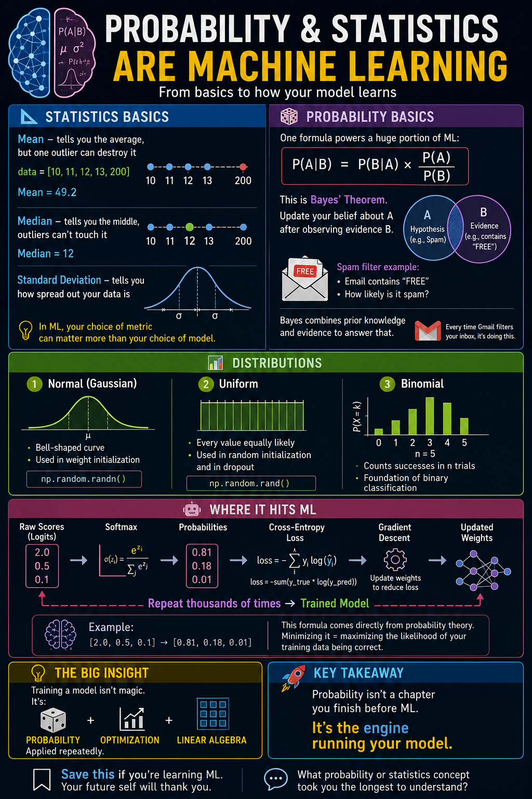

# Day 2 — Probability & Statistics for Machine Learning



Probability and statistics form the second major pillar of machine-learning mathematics. Linear algebra describes the **shape and structure of data**; statistics helps us **understand the data**, and probability helps us **reason under uncertainty**.

An ML model usually does not produce an absolute answer. It estimates which answer is most probable given the available input.

## Why probability matters in ML

- Cross-entropy and many other loss functions come from probability.
- Naive Bayes, logistic regression, and Bayesian networks are probabilistic models.
- Prediction confidence is expressed as a probability.
- Dropout and data augmentation introduce controlled randomness.
- Large language models predict a probability distribution over the next token.

## What I learned

### 1. Descriptive statistics

| Statistic | Meaning | ML use |
|---|---|---|
| Mean | Arithmetic average | Baselines, imputation, normalization |
| Median | Middle sorted value | Robust summary for skewed or noisy data |
| Variance | Average squared distance from the mean | Measuring spread, feature analysis, PCA |
| Standard deviation | Square root of variance | Scaling features and detecting outliers |
| Correlation | Strength and direction of a linear relationship | Exploring relationships and redundant features |

```python
import numpy as np

data = np.array([5, 6, 6, 7, 7, 7, 8, 8, 9, 10, 12])

print("Mean:", np.mean(data))
print("Median:", np.median(data))
print("Standard deviation:", np.std(data))
print("Variance:", np.var(data))
```

#### Mean vs. median when outliers exist

Consider `[1, 2, 3, 4, 100]`:

- Mean = `22`
- Median = `3`

The outlier pulls the mean far away from a typical value, while the median remains stable. This is why it is important to inspect both—especially with skewed, noisy, or real-world data.

### 2. Probability fundamentals

Probability is always between 0 and 1:

```text
0 ≤ P(A) ≤ 1
```

#### Conditional probability

Conditional probability measures the probability of event A after event B is known to have occurred:

```text
P(A | B) = P(A ∩ B) / P(B)
```

For example, a spam filter might estimate the probability that an email is spam given that it contains the word “FREE.”

#### Bayes' theorem

```text
P(A | B) = P(B | A) × P(A) / P(B)
```

Bayes' theorem updates an existing belief after observing new evidence. It connects:

- **Prior** — belief before seeing the evidence
- **Likelihood** — probability of the evidence under a hypothesis
- **Posterior** — updated belief after seeing the evidence

### 3. Important probability distributions

| Distribution | Description | Example ML connection |
|---|---|---|
| Normal (Gaussian) | Symmetric bell-shaped distribution | Noise models, standardized features, some initialization methods |
| Uniform | Every value in a range is equally likely | Random sampling and some initialization schemes |
| Bernoulli | One binary trial | Binary outcomes and dropout masks |
| Binomial | Number of successes across repeated Bernoulli trials | Modeling success counts |

```python
import numpy as np
from scipy import stats

dist = stats.norm(loc=0, scale=1)

print(dist.pdf(0))       # density at zero: about 0.399
print(dist.cdf(1.96))    # probability below 1.96: about 0.975

normal_samples = np.random.randn(1000)
uniform_samples = np.random.uniform(0, 1, 1000)
```

> A probability density is not the probability of one exact continuous value. Probabilities are obtained from areas over intervals; the CDF gives accumulated probability up to a value.

### 4. Probability concepts that directly power ML

#### Maximum Likelihood Estimation (MLE)

MLE finds parameters that make the observed training data as likely as possible. Many common loss functions are negative log-likelihoods, so minimizing the loss is equivalent to maximizing likelihood.

#### Softmax

Softmax converts a vector of real-valued scores, called **logits**, into a probability distribution:

```python
import numpy as np

def softmax(x):
    x = np.asarray(x, dtype=float)
    exp_x = np.exp(x - np.max(x))  # numerical stability
    return exp_x / exp_x.sum()

scores = np.array([2.0, 1.0, 0.1])
print(softmax(scores))
# approximately [0.659, 0.242, 0.099]
```

All outputs are between 0 and 1, and together they sum to 1. Softmax is commonly used for single-label multiclass classification; not every classifier uses it.

#### Cross-entropy loss

For one-hot encoded targets, categorical cross-entropy is:

```text
Loss = −Σ yᵢ log(pᵢ)
```

If the true class is dog and the model assigns dog a probability of `0.8`, the loss is:

```text
−log(0.8) ≈ 0.223
```

A confident correct prediction produces a low loss. A low probability for the correct class produces a high loss.

#### The classification chain

```text
Raw scores (logits) → Softmax → Class probabilities → Cross-entropy → Loss
```

During training, an optimizer uses gradients of that loss to adjust the model's parameters.

### 5. Correlation vs. causation

```python
import numpy as np

x = np.array([1, 2, 3, 4, 5])
y = np.array([2, 4, 5, 4, 5])

correlation = np.corrcoef(x, y)[0, 1]
print(correlation)  # approximately 0.77
```

Pearson correlation ranges from `-1` to `+1`:

- Near `+1`: strong positive linear relationship
- Near `0`: weak or no linear relationship
- Near `-1`: strong negative linear relationship

Correlation does not prove causation. Ice-cream sales and drowning incidents may rise together because both are influenced by warm weather. Highly correlated features can also carry redundant information, but they should not be dropped automatically—the decision depends on the model, objective, and validation results.

## Mini-project — Softmax and cross-entropy from scratch

```python
import numpy as np

def softmax(x):
    x = np.asarray(x, dtype=float)
    exp_x = np.exp(x - np.max(x))
    return exp_x / exp_x.sum()

def cross_entropy_loss(y_true, logits):
    probabilities = softmax(logits)
    probabilities = np.clip(probabilities, 1e-9, 1.0)
    return -np.sum(y_true * np.log(probabilities))

# Three classes: cat, dog, bird
y_true = np.array([0, 1, 0])

good_prediction = np.array([0.1, 3.0, 0.2])
bad_prediction = np.array([2.0, 0.5, 1.5])

print("Good prediction loss:", round(cross_entropy_loss(y_true, good_prediction), 4))
print("Bad prediction loss:", round(cross_entropy_loss(y_true, bad_prediction), 4))

# Good prediction loss: approximately 0.1096
# Bad prediction loss:  approximately 2.1041
```

This combines the same core operations that frameworks such as PyTorch provide in a numerically optimized form. PyTorch's `nn.CrossEntropyLoss` accepts logits directly and internally combines log-softmax with negative log-likelihood.

## Connecting

- **Linear algebra:** vectors, matrices, transformations, and data shapes
- **Probability and statistics:** distributions, uncertainty, confidence, and loss
- **Next — Calculus:** gradients and how models improve their parameters

Together, these ideas explain the core training loop: represent data, calculate probabilistic predictions, measure error, and update the parameters.

## Quick reference

```python
np.mean(x)                 # mean
np.median(x)               # median
np.std(x)                  # population standard deviation
np.var(x)                  # population variance
np.corrcoef(x, y)          # correlation matrix
np.random.randn(n)         # standard-normal samples
np.random.uniform(0, 1, n) # uniform samples
```

## Knowledge check

Try answering these before opening the answer key.

1. For the data `[1, 2, 3, 4, 100]`, what are the mean and median? Which better represents a typical value, and why?
2. What does `P(spam | contains “FREE”)` mean in plain English?
3. Which function converts multiclass logits such as `[1.2, 0.4, 2.1]` into probabilities that sum to 1?
4. If two features have a Pearson correlation of `-0.95`, what can—and cannot—be concluded?
5. Why does cross-entropy heavily penalize assigning a very small probability to the true class?

<details>
<summary><strong>Answer key</strong></summary>

### 1. Mean and median

The mean is `(1 + 2 + 3 + 4 + 100) / 5 = 22`, and the median is `3`. The median better represents a typical value here because the outlier `100` strongly pulls up the mean.

### 2. Conditional probability

It means: “the probability that an email is spam, given that we already know it contains the word ‘FREE.’” It does not mean that every email containing that word is spam.

### 3. Converting logits

The **softmax** function converts multiclass logits into non-negative probabilities that sum to 1.

### 4. Negative correlation

It indicates a strong negative linear relationship: as one feature increases, the other tends to decrease. It does not establish that either feature causes the other to change, and it does not automatically mean one feature must be removed.

### 5. Cross-entropy penalty

For the true class, the loss contains `−log(p)`. As `p` approaches zero, `log(p)` becomes a very large negative number, so `−log(p)` becomes very large. The loss therefore strongly penalizes confident wrong predictions.

</details>


## Key takeaway

Statistics summarizes what the data looks like. Probability quantifies uncertainty. In classification, a model produces scores, softmax can turn those scores into probabilities, and cross-entropy measures how well those probabilities match the truth. Training then adjusts the model to reduce that loss.

